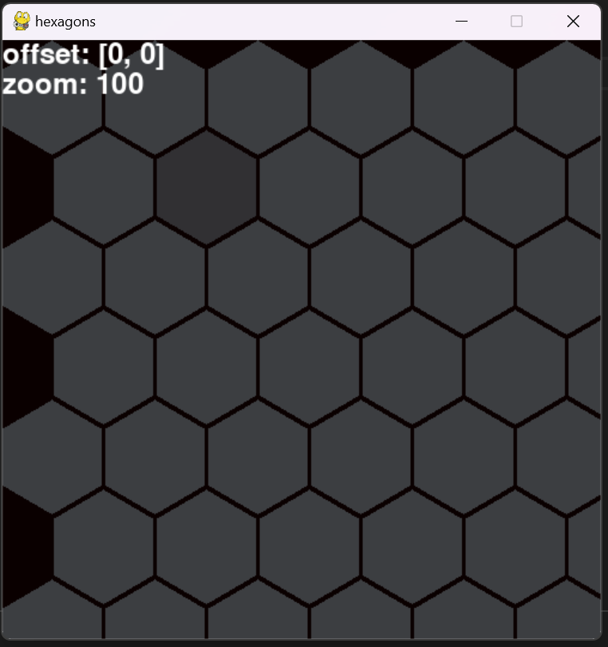

toto mel byt zaklad pro hru kterou jsem chtel stvorit,
nicmene jsem dosel pouze k tomu ze jsem vytvoril funkci hex-grid
bohuzel jsem zjistil ze v takovem scalu v jakem jsem to zamyslel (100 000 000) hexagonu
by to nebylo proveditelne, vyzkousel jsem spoustu alternativ jak hexagony vykreslovat,
ale kdybych aplikoval vse na co jsem prisel, tak uz z toho neni jednoduchy projekt,
proto s timto projektem prozatim koncim a jdu se venovat dalsim vecem

